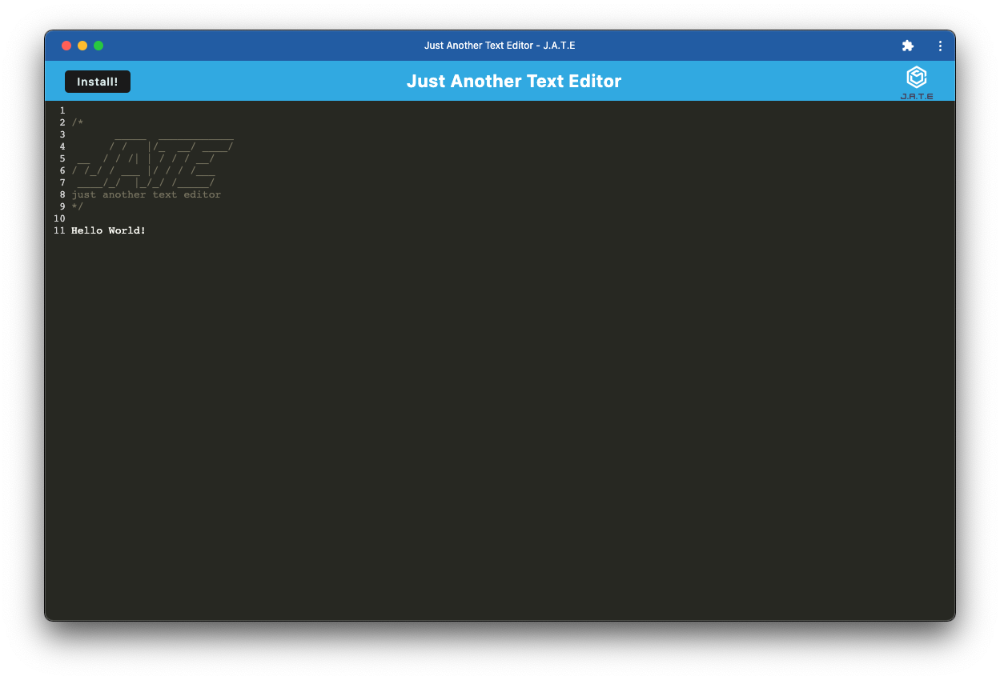

# Social-Network-API

[](https://opensource.org/licenses/MIT)

## Description

This is a web application Text Editor that runs in the browser. The app is a single page application that meets PWA criteria.

## Table of Contents

- [Description](#description)
- [Installation](#installation)
- [Usage](#usage)
- [Screenshot](#screenshot)
- [Deployed Link](#deployed-link)
- [Contact](#contact)

## Installation

```md
Run (npm install)
```

## Usage

```md
Run (npm start)
```

# Screenshot



## Deployed Link

[Click Here!](https://drive.google.com/file/d/1x09LRCLRRAigZa8X_GE28AKoMZK0zM9H/view?usp=sharing)

## Contact

Email: vancungthawng@outlook.com

Github: [Click Here!](https://github.com/vanjungthawng)
